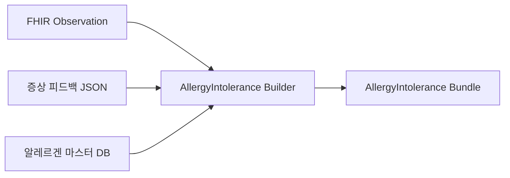

# 🧬 AllergyIntolerance Bundle 생성 가이드

## 1. 리소스 생성 워크플로우

### 1.1 입력 데이터 통합


### 1.2 결정 트리
```
IF 양성 AND 증상있음 → verificationStatus: "confirmed"
IF 양성 AND 증상없음 → verificationStatus: "refuted"  
IF 양성 AND 노출없음 → verificationStatus: "unconfirmed"
IF 음성 → AllergyIntolerance 생성 안 함
```

## 2. 상세 매핑 규칙

### 2.1 Clinical Status 결정
```python
def determine_clinical_status(allergen_data):
    if allergen_data['symptomatic']:
        return 'active'
    elif allergen_data['resolved']:
        return 'resolved'
    else:
        return 'inactive'
```

### 2.2 Criticality 평가
```python
CRITICALITY_MATRIX = {
    'anaphylaxis_risk': 'high',
    'respiratory_symptoms': 'high',
    'skin_only': 'low',
    'unknown': 'unable-to-assess'
}
```

### 2.3 Reaction 구조화
```json
{
  "reaction": [{
    "substance": {
      "coding": [{
        "system": "http://snomed.info/sct",
        "code": "allergen_snomed_code",
        "display": "allergen_name"
      }]
    },
    "manifestation": [{
      "coding": [{
        "system": "http://snomed.info/sct",
        "code": "symptom_code",
        "display": "symptom_name"
      }]
    }],
    "severity": "mild|moderate|severe",
    "exposureRoute": {
      "coding": [{
        "system": "http://snomed.info/sct",
        "code": "route_code"
      }]
    },
    "onset": "datetime",
    "note": [{
      "text": "additional_notes"
    }]
  }]
}
```

## 3. Bundle 조립

### 3.1 Bundle 구조
```json
{
  "resourceType": "Bundle",
  "type": "collection",
  "identifier": {
    "system": "urn:hospital:allergy",
    "value": "bundle-uuid"
  },
  "timestamp": "2025-10-12T10:00:00Z",
  "entry": [
    {
      "fullUrl": "urn:uuid:allergyintolerance-1",
      "resource": {/* AllergyIntolerance */}
    }
  ],
  "signature": {
    "type": [{
      "system": "urn:iso-astm:E1762-95:2013",
      "code": "1.2.840.10065.1.12.1.1"
    }],
    "when": "2025-10-12T10:00:00Z",
    "who": {
      "reference": "Practitioner/doctor-id"
    }
  }
}
```

### 3.2 예시: 집먼지진드기 알레르기
```json
{
  "resourceType": "AllergyIntolerance",
  "id": "dust-mite-allergy",
  "clinicalStatus": {
    "coding": [{
      "system": "http://terminology.hl7.org/CodeSystem/allergyintolerance-clinical",
      "code": "active",
      "display": "Active"
    }]
  },
  "verificationStatus": {
    "coding": [{
      "system": "http://terminology.hl7.org/CodeSystem/allergyintolerance-verification",
      "code": "confirmed",
      "display": "Confirmed"
    }]
  },
  "type": "allergy",
  "category": ["environment"],
  "criticality": "low",
  "code": {
    "coding": [{
      "system": "http://snomed.info/sct",
      "code": "419474003",
      "display": "Dermatophagoides farinae"
    }],
    "text": "집먼지진드기"
  },
  "patient": {
    "reference": "Patient/P001",
    "display": "홍길동"
  },
  "encounter": {
    "reference": "Encounter/E001"
  },
  "recordedDate": "2025-10-11",
  "recorder": {
    "reference": "Practitioner/dr-kim"
  },
  "reaction": [{
    "manifestation": [{
      "coding": [{
        "system": "http://snomed.info/sct",
        "code": "49727002",
        "display": "Cough"
      }]
    }, {
      "coding": [{
        "system": "http://snomed.info/sct",
        "code": "267036007",
        "display": "Dyspnea"
      }]
    }],
    "severity": "moderate",
    "exposureRoute": {
      "coding": [{
        "system": "http://snomed.info/sct",
        "code": "447694001",
        "display": "Respiratory tract route"
      }]
    }
  }]
}
```

## 4. 검증 및 품질 보증

### 4.1 필수 검증 항목
- [ ] 모든 필수 필드 존재
- [ ] 코드 시스템 유효성
- [ ] 참조 리소스 존재 확인
- [ ] 날짜 형식 검증
- [ ] 논리적 일관성 (예: refuted + reaction 동시 존재 불가)

### 4.2 FHIR 검증 도구
```bash
# HAPI FHIR Validator 사용
java -jar validator_cli.jar \
  -version 4.0 \
  -ig hl7.fhir.r4.core \
  allergyintolerance_bundle.json
```

## 5. 상호운용성 고려사항

### 5.1 표준 준수
- HL7 FHIR R4 명세 완전 준수
- SNOMED CT 국제판 사용
- UTC 시간대 사용

### 5.2 확장성
```json
{
  "extension": [{
    "url": "http://hospital.local/confidence-score",
    "valueDecimal": 0.95
  }, {
    "url": "http://hospital.local/data-source",
    "valueString": "SPT-2025-10-11"
  }]
}
```

## 6. 모니터링 및 감사

### 6.1 로깅
```json
{
  "audit_log": {
    "timestamp": "2025-10-12T10:00:00Z",
    "action": "create_allergyintolerance",
    "user": "system",
    "patient": "P001",
    "allergens_processed": 12,
    "allergens_confirmed": 3,
    "processing_time_ms": 245
  }
}
```

### 6.2 메트릭스
- Bundle 생성 성공률
- 평균 처리 시간
- 검증 실패 원인 분석
- 데이터 완전성 점수