# 2026-09-08 Update: FHIR Observation hardening + dual UI (Quest / Classic) side by side

> **Summary** — ① FHIR Observation now carries **every result, including 0, below-detection (<LoD) and N/A**, and `code`/`method` use only **SNOMED CT codes verified as existing and active on an official terminology server** (two of the previous codes were wrong). ② The gamified "Allergen Exploration Quest" UI and the pre-redesign Classic UI are **served concurrently from the same server** with header links to switch. Both UIs call the same `/api`, so assessments, reports and FHIR output are identical.
>
> Korean version: [`release_2026-09-08_fhir_dual_ui.ko.md`](release_2026-09-08_fhir_dual_ui.ko.md)

| Item | Value |
|---|---|
| Branch / commits | `claude/allergy-test-report-x4lgqh` · `42aa3be` (FHIR) · `3bf4ea4` (dual UI) |
| PR | [#1](https://github.com/DrugnSafety/APAAACI_mast_to_HL7FHIR/pull/1) |
| Verification | 26 regression tests (`python3 test_relevance_engine.py`), 9 game-logic tests (`node --test web/game.test.js`), demo flow captured in a real browser for both UIs |

---

## 1. FHIR Observation hardening

### 1-1. What was wrong
- **Results without a numeric value could be lost.** For MAST/UniCAP, a `None` value produced an Observation with no `valueQuantity` and no `dataAbsentReason` (a FHIR rule violation), and report strings such as `<0.35`, `N/A` or `undetectable` failed numeric parsing and **the original text was discarded**.
- **Two SNOMED CT codes were wrong.**
  - `398166005`, used for SPT, is not "Skin prick test" but **"Performed (qualifier value)"**.
  - `165967004`, used for specific IgE, **does not exist** in SNOMED CT International.
- MAST/UniCAP Observations had no `method` (assay technique).

### 1-2. How codes were verified, and the result
Every SCTID was checked with `CodeSystem/$lookup` on the HL7 terminology server **tx.fhir.org** (SNOMED CT International Edition **2025-02-01**, `property=inactive`). Codes proposed by an external AI were re-verified the same way; several turned out to be **incorrect and were rejected**.

| Use | Adopted code | tx.fhir.org display | Active | Note |
|---|---|---|---|---|
| SPT `Observation.code` | **37968009** | Prick test (procedure) | ✔ | replaces `398166005` ("Performed") |
| MAST `Observation.code` | **399788006** | Allergen specific IgE antibody measurement, MAST type | ✔ | replaces non-existent `165967004` |
| UniCAP `Observation.code` | **397691009** | Allergen specific IgE antibody measurement, quantitative | ✔ | ImmunoCAP is quantitative sIgE |
| MAST `Observation.method` | **703446000** | Immunoblot assay (qualifier value) | ✔ | child of Technique (272394005); MAST panels (e.g., AlloScreen) are immunoblot-based |
| UniCAP `Observation.method` primary | **703447009** | Enzyme immunoassay technique (qualifier value) | ✔ | FEIA is a form of enzyme immunoassay |
| UniCAP `Observation.method` secondary | **703444002** | Immunofluorescence technique (qualifier value) | ✔ | fluorescence read-out; the proposed name "Fluorescent immunoassay technique" is not its actual FSN |
| SPT `Observation.method` | OMOP concept `36703747` (Athena) + text | Skin prick test histamine positive control | — | no prick-specific code exists under the SNOMED Technique hierarchy (search returned 0), so the CDM coding is kept |

**Proposals rejected during verification**

| Proposal | Actual | Decision |
|---|---|---|
| LOINC `32614-0` "Allergen D1 Specific IgE Ab … by Fluoenzymeimmunoassay" | NLM Clinical Tables: **Glutamate [Moles/volume] in Body fluid** | rejected |
| LOINC `62464-3` "Allergen IgE Ab panel in Serum by Immunoblot" | NLM Clinical Tables: **Enterovirus RNA … by NAA with probe detection** | rejected |
| `703444002` = "Fluorescent immunoassay technique" | actual display: **Immunofluorescence technique** | active, so kept as secondary with corrected display |
| `37310002` Immunoblot assay (procedure) | active but in the **procedure** hierarchy | not used: `method` should bind to technique (qualifier) codes |

LOINC codes are per-allergen (e.g., 112129-2 American house dust mite IgE Ab … by Immunoassay), so a per-allergen mapping table is required. This round unifies `Observation.code` on SNOMED procedure codes and keeps allergen identity in the existing **CDM (OMOP) SNOMED pre-mapping `component`**. Per-allergen LOINC is follow-up work.

### 1-3. Value representation rules (`services/fhir_service.py`)

| Report text | FHIR representation | Example |
|---|---|---|
| number (incl. 0) | `valueQuantity` | `0.0 kU/L`, `17.6 kU/L` |
| `<0.35`, `< 0.10` | `valueQuantity` + `comparator: "<"` | `{"comparator":"<","value":0.35}` |
| `undetectable`, `ND` | `comparator "<"` + limit of detection **0.35 kU/L** + note | sIgE class 0/1 boundary |
| `N/A`, empty | `dataAbsentReason` (`not-performed`; other strings → `unknown` + text) | no value |
| SPT with no wheal size | `dataAbsentReason` | neither size_text nor mean_mm |
| MAST/UniCAP class (0–6) | `component` with `valueInteger` | class 0 preserved |

A new `AllergenResult.value_text` field preserves the raw string; the OCR parser stores any value that fails numeric conversion there instead of dropping the row.

### 1-4. Live output examples
Demo data (MAST, 6 items, 1 negative) run in both UIs and inspected in the FHIR tab. The JSON is identical in both.

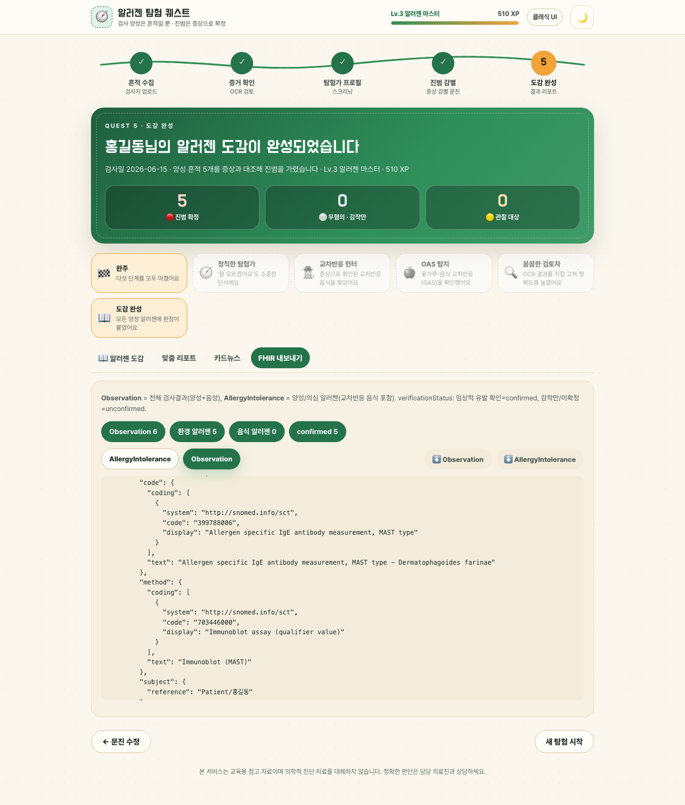
*Quest UI — `code` 399788006 (MAST type), `method` 703446000 (Immunoblot assay). Observation 6 = 5 positive + 1 negative (dog dander 0.1 kU/L, class 0).*

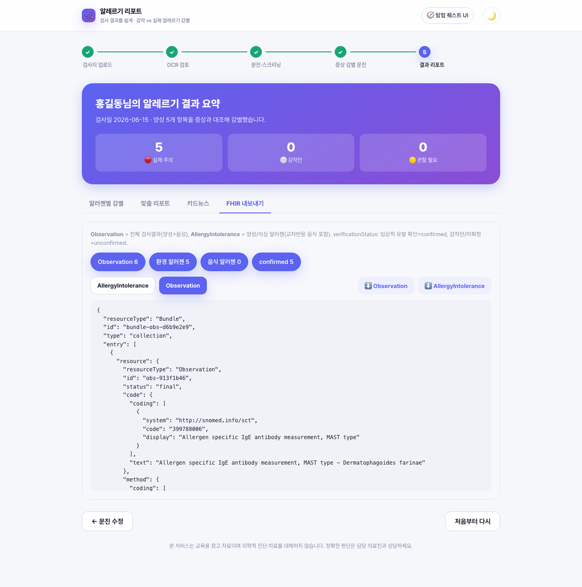
*Classic UI — same API, same bundle.*

Full sample (MAST 4 rows: positive · 0 · `<0.35` · `N/A`, UniCAP, SPT 2 rows): [`screenshots/2026-09-08/fhir_observation_samples.json`](screenshots/2026-09-08/fhir_observation_samples.json)

```json
{ "code": {"coding": [{"system": "http://snomed.info/sct", "code": "399788006",
             "display": "Allergen specific IgE antibody measurement, MAST type"}]},
  "method": {"coding": [{"system": "http://snomed.info/sct", "code": "703446000",
             "display": "Immunoblot assay (qualifier value)"}], "text": "Immunoblot (MAST)"},
  "valueQuantity": {"value": 0.35, "comparator": "<", "unit": "kU/L",
                    "system": "http://unitsofmeasure.org", "code": "kU/L"},
  "interpretation": [{"coding": [{"code": "NEG"}]}],
  "component": [{"code": {"text": "IgE class (0-6, report semi-quantitative class)"}, "valueInteger": 0}] }
```

### 1-5. Input algorithm per test type (reviewed)
| Test | Input fields | Positivity | Strength (stars) | Observation |
|---|---|---|---|---|
| SPT | `size_text` (major×minor) → `mean_mm`, `wheal_major/minor`, histamine control | mean ≥ 3 mm or ≥ 50% of histamine | 3–5 / 5–8 / ≥8 mm | code 37968009, value = mean mm, components major/minor/mean/A-H (CDM qualifiers) |
| MAST | `value` (kU/L or IU/mL), `class` (0–6) | class ≥ 1 or ≥ 0.35 kU/L | class 1–2 / 3–4 / 5–6 | code 399788006, method 703446000, class component |
| UniCAP | `value` (kU/L), `class` | same as MAST | same | code 397691009, method 703447009 + 703444002 |

The OCR prompt (`instructions/OCR_prompt.md`) and parser (`services/ocr_service.py`) exclude only the Total IgE summary row and **keep every other row**. Rows shown under the "zero-value items" tab of the OCR review table are exported to FHIR as well.

---

## 2. Dual UI side by side

| | Allergen Exploration Quest UI | Classic UI |
|---|---|---|
| Path | `/` | `/classic/` |
| Source | `web/index.html`, `web/app.js`, `web/game.js`, `web/styles.css` | `web/classic/*` (UI as of commit `d5eb5f4`, asset paths rewritten to `/classic/`) |
| Switch | header link **"클래식 UI"** | header link **"🧭 탐험 퀘스트 UI"** |
| Data | same `/api/*`; same assessment, report, card news, FHIR | same |
| Check | `GET /api/health` → `build.features.ui_modes = ["quest","classic"]` | |

`server.py` mounts `/classic` first and `/` last. The Classic UI is a **comparison and regression baseline**, not a maintained product surface; which one becomes the default will be decided from patient feedback.

### Screen comparison (same demo data)

| Step | Quest UI | Classic UI |
|---|---|---|
| Start | 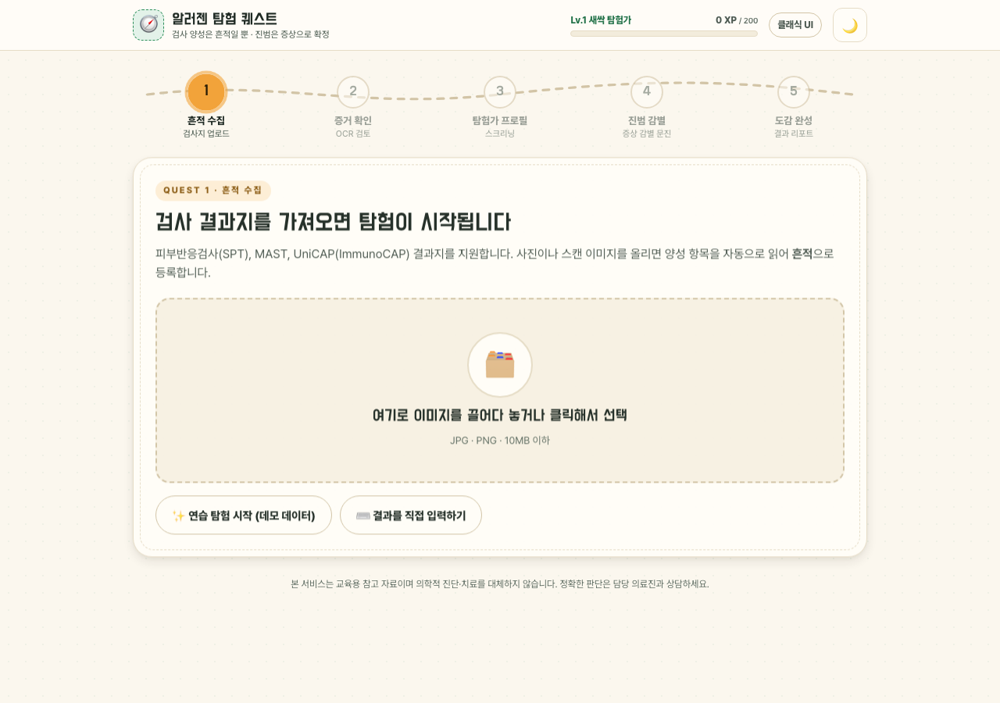 | 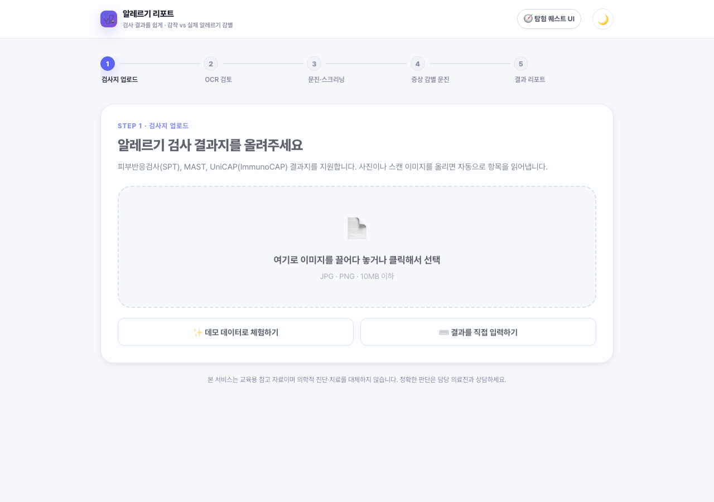 |
| Discovery / OCR review | 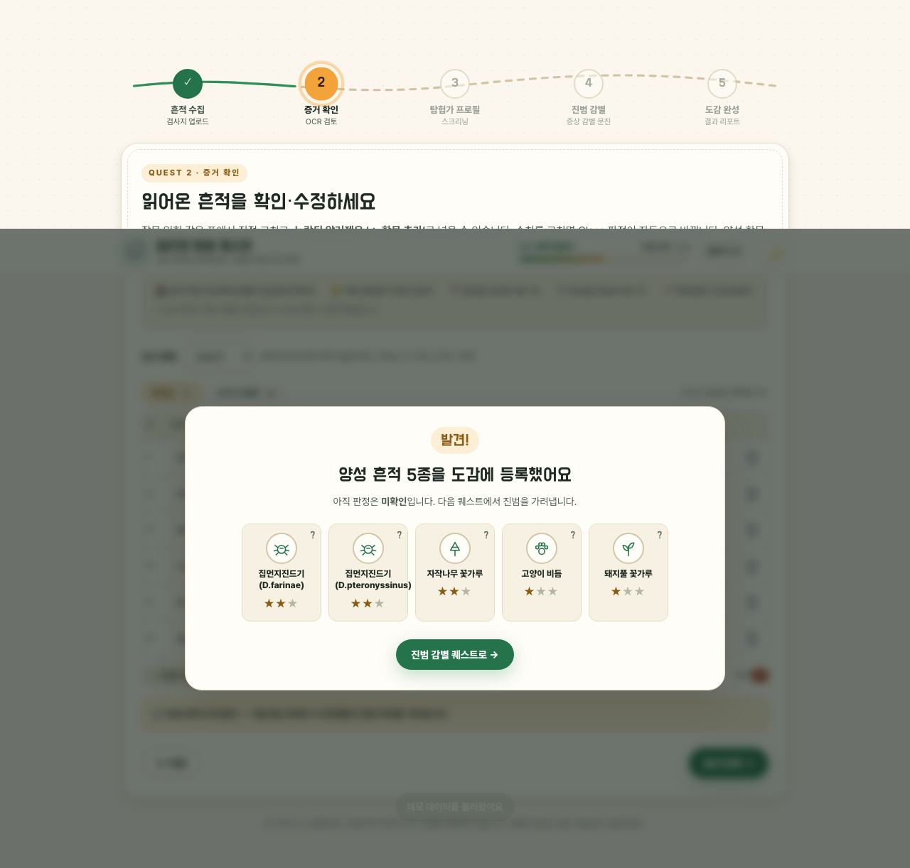 | 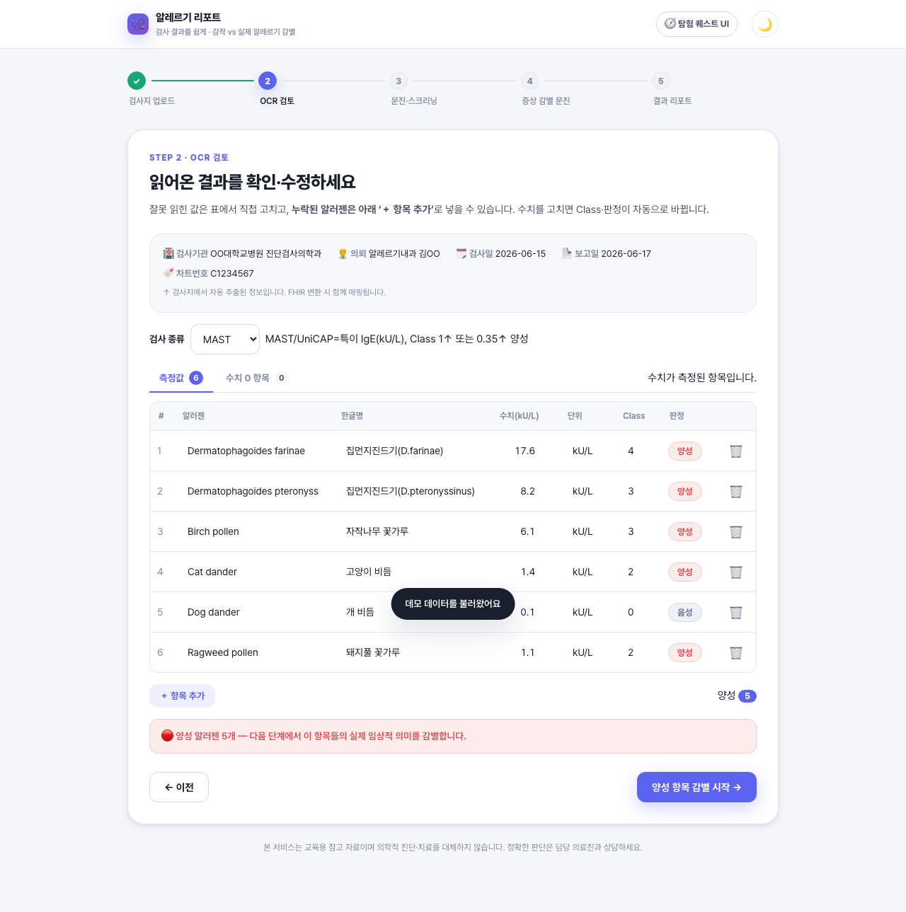 |
| Questionnaire | 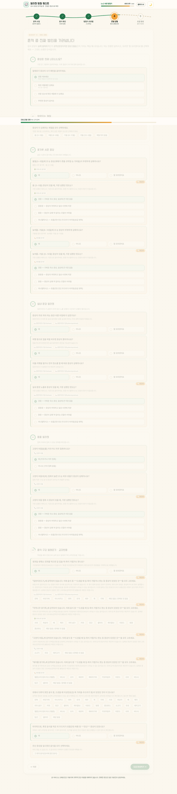 | 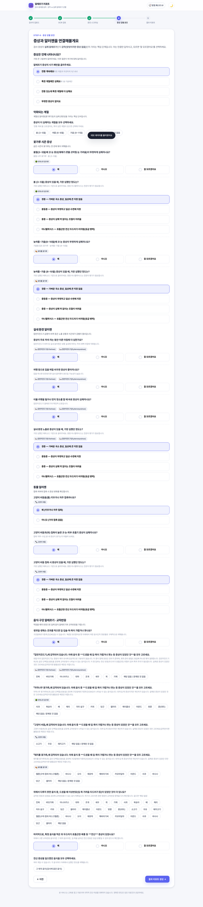 |
| Results | 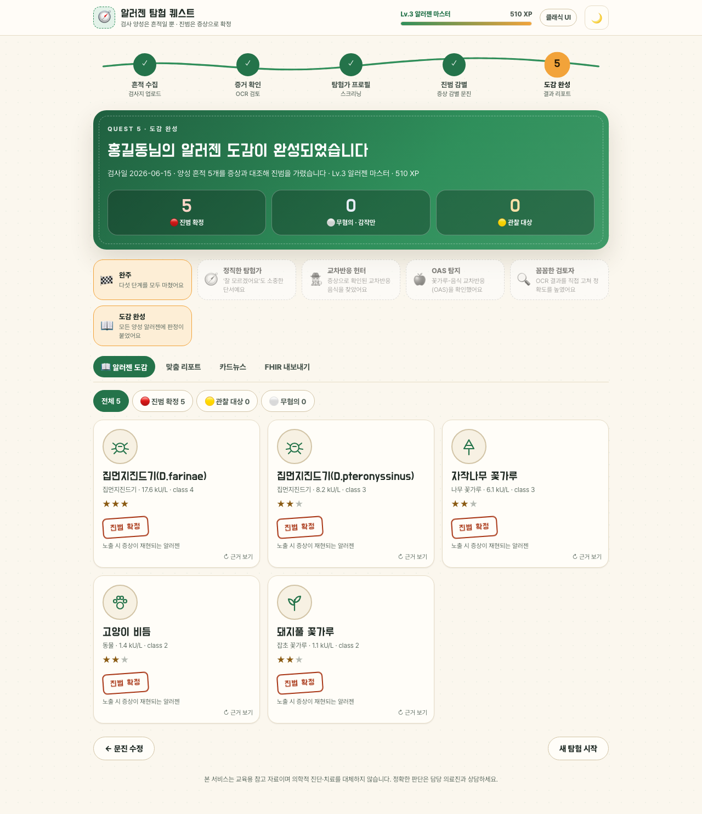 | 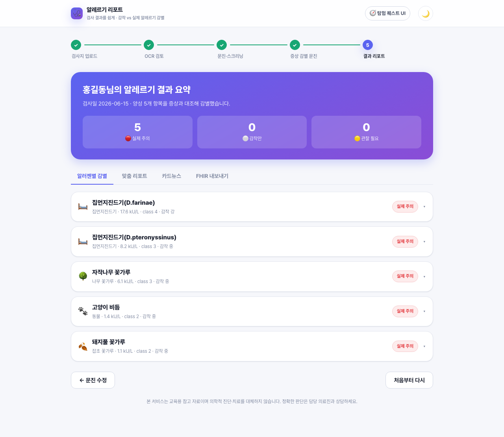 |

Dark mode and mobile (Quest UI): `screenshots/2026-09-08/quest-dark-dex.png`, `quest-mobile-dex.png`

---

## 3. How to run
```bash
uvicorn server:app --port 8787      # pick another port if 8000 is taken
# Quest UI    http://127.0.0.1:8787/
# Classic UI  http://127.0.0.1:8787/classic/
python3 test_relevance_engine.py    # 26 tests
node --test web/game.test.js        # 9 tests
```

## 4. Q&A (settled 2026-09-08)
**Q1. Aren't allergens already mapped to SNOMED? Why LOINC?**
Correct. Allergen (substance) identity is already SNOMED-coded in `Observation.component` and `AllergyIntolerance.code`: 22 real SCTIDs (`data/snomed_ct_map.json`, user-reviewed, first priority) plus the hospital CDM pre-mapping of 155 items (`data/cdm_snomed_mapping.json`, 153 SNOMED · 2 LOINC, 393 aliases, second priority). LOINC is a different axis: it codes **the test itself** ("specific IgE for allergen X", e.g., 112129-2), not the substance. Since `Observation.code` uses one SNOMED procedure code per test type, per-allergen LOINC is **optional**, needed only if a receiving EMR requires LOINC test codes. Note: the 155 CDM codes are OMOP concept_ids; only the 22 are strict SCTIDs.

**Q2. Below-LoD results: store the measurement as-is, and let clinical interpretation follow the questionnaire?**
Correct, and that is how it is implemented. ① `Observation.valueQuantity` carries the laboratory measurement as reported (`<0.35` → `comparator "<"` + 0.35; `undetectable` → below LoD with the original text in a note). ② `Observation.interpretation` carries only the laboratory call (POS/NEG). ③ Clinical relevance follows the questionnaire into `AllergyIntolerance.verificationStatus` and `criticality`. The earlier idea of adding `<` (Off scale low) to `interpretation` is **dropped**.

## 5. Deploying as a web service
`Dockerfile`, `.dockerignore` and `render.yaml` were added: one container + one `OPENAI_API_KEY`. Steps and operations checklist (Korean): [`deploy.ko.md`](deploy.ko.md) — Render Blueprint recommended; Railway/Fly.io; self-hosted VPS + Caddy.

## 6. Models and APIs in use
| Stage | Model | API |
|---|---|---|
| OCR | OpenAI `gpt-4o` (vision, detail high), overridable via `OPENAI_VISION_MODEL` | OpenAI Chat Completions (`openai` SDK) |
| Report narrative (optional) | OpenAI `gpt-4o` via `OPENAI_REPORT_MODEL`; default report is deterministic | same |
| Questionnaire, assessment, cross-reactivity, FHIR, card news | no LLM | — |

## 7. Language selection (한국어 · English · 中文)
A language selector in the header switches the Quest UI **chrome** (header, trail, HUD, step copy, buttons, table headers, badges, verdict stamps, result tabs, FHIR help) between Korean, English and Simplified Chinese. The choice is stored in `localStorage.lang`; first visits auto-detect from `navigator.language` (and `<html lang>` is updated).

| Piece | Location |
|---|---|
| Dictionaries, 3 languages × ~190 keys | `web/i18n.js` (UMD) |
| Key-parity and placeholder tests (4) | `web/i18n.test.js` (`node --test web/i18n.test.js`) |
| String substitution | `t()` calls in `web/app.js`, `tr` hook in `web/game.js` |
| Selector | `web/index.html` `#langSel`, `data-i18n` attributes |

**Scope limit**: questionnaire items, knowledge-base text, the report and card news are generated in Korean by the server (`/api`) and remain Korean; a notice banner says so on the profile and questionnaire steps when a non-Korean UI language is active. The Classic UI (`/classic/`) stays Korean-only as the comparison baseline.

| English | 中文 |
|---|---|
| 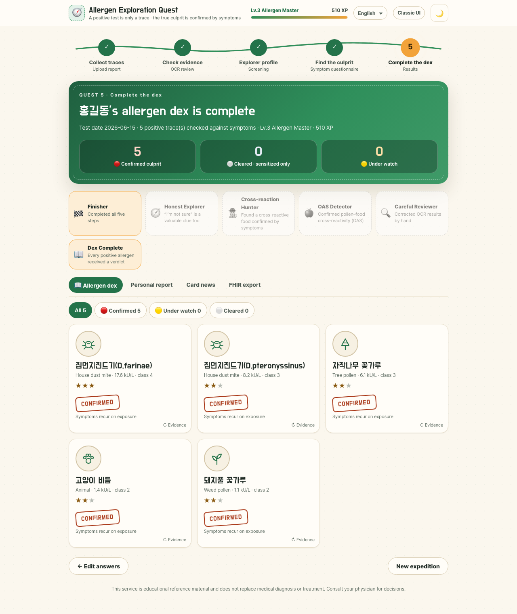 | 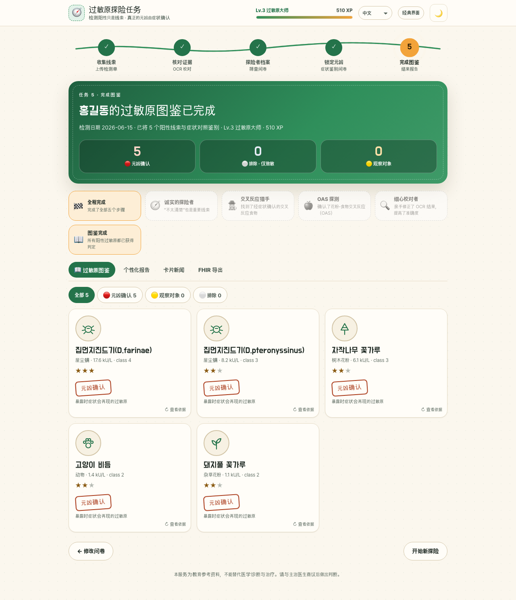 |

## 8. Follow-ups
- Localize server-generated content (questionnaire, KB, report, card news): needs a `lang` parameter on `/api/*` and string tables in questionnaire_service (sizeable).
- Decide whether the Classic UI gets i18n.
- (optional) per-allergen LOINC test codes if a receiving EMR requires them.
- Extend real SCTID coverage beyond the 22 confirmed allergens.
- Decide the default UI from patient feedback.
